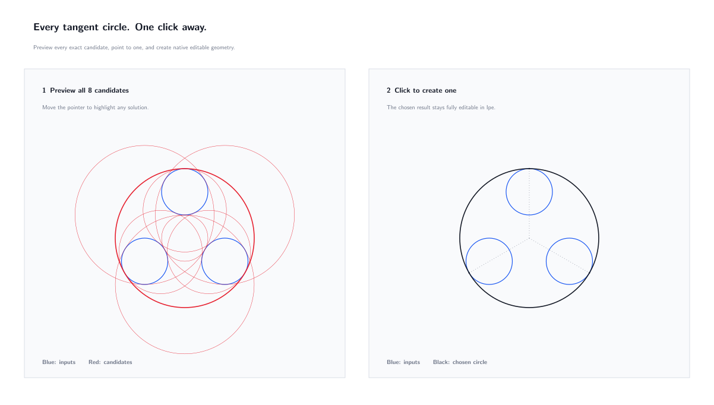

# Coleção de Ipelets

[Read in English](README.md)

Uma coleção organizada de extensões independentes para o [editor de desenhos Ipe](https://ipe.otfried.org/). Cada Ipelet possui sua própria pasta, com instruções de instalação, exemplos, testes e notas de versão.

[](circles/README.pt-BR.md)

## Ipelets disponíveis

| Ipelet | Versão | Descrição |
| --- | --- | --- |
| [Circles](circles/README.pt-BR.md) | 1.0.0 | Construções de circunferências, tangências, inversão, geometria radical, marcação de centros e pré-visualização ao vivo. |

## Instalação rápida

No Linux, instale um Ipelet com o utilitário do repositório:

```bash
./scripts/install.sh circles
```

O utilitário detecta a instalação Flatpak do Ipe e, nos demais casos, utiliza a pasta padrão `~/.ipe/ipelets`. Reinicie o Ipe depois da instalação.

As instruções manuais e os detalhes específicos de cada plataforma ficam documentados dentro da pasta de cada Ipelet.
Os pacotes prontos estão disponíveis na [versão mais recente do GitHub](https://github.com/japbcoelho/ipelets/releases/latest).

## Organização do repositório

```text
.
├── circles/          Código, documentação, exemplos e testes do Circles
├── scripts/          Utilitários de instalação, validação e empacotamento
├── .github/          Integração contínua e modelos de contribuição
└── LICENSE           Licença do repositório
```

A instalação contém somente o arquivo `.lua` correspondente. Os pacotes de lançamento também incluem a documentação, os exemplos editáveis, a licença e as imagens de apresentação; os testes e utilitários de desenvolvimento ficam separados do Ipelet executado pelo Ipe.

## Validação

Execute todas as verificações locais com:

```bash
./scripts/validate.sh
```

As mesmas verificações são executadas pelo GitHub Actions. Elas validam a sintaxe Lua, executam a suíte independente de regressões geométricas e conferem o contrato público de execução.

## Versões para lançamento

Crie um arquivo para lançamento com:

```bash
./scripts/package.sh circles
```

O arquivo gerado e sua soma de verificação SHA-256 são colocados em `dist/` e, intencionalmente, não são versionados pelo Git. O pacote é autocontido: todos os links relativos dos arquivos README funcionam dentro dele.

## Como contribuir

Consulte [CONTRIBUTING.md](CONTRIBUTING.md). Relatos de erros e sugestões podem utilizar os formulários de issue incluídos no repositório.

## Licença

Esta coleção é licenciada sob a GNU General Public License, versão 3 ou qualquer versão posterior. Consulte [LICENSE](LICENSE) e [NOTICE.md](NOTICE.md).
