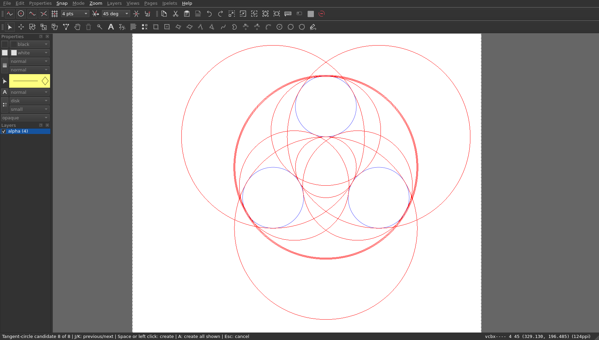
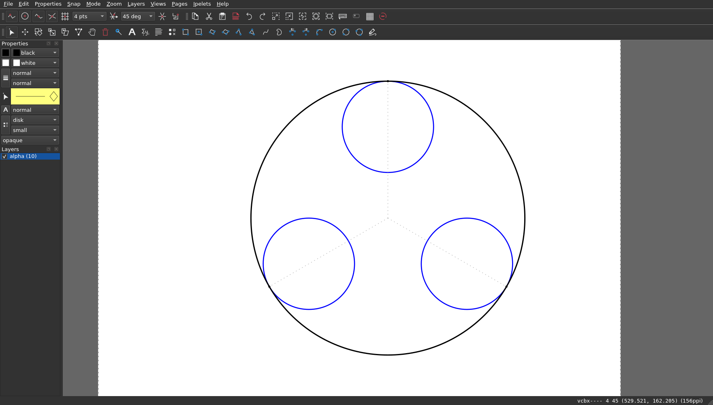

# Circles for Ipe

[Leia em português](README.pt-BR.md)


Circles is a standalone Lua ipelet for exact and practical circle geometry. It combines construction dialogs, live canvas previews, stable analytic solvers, undo-aware output, and editable native Ipe objects in one file.

## Signature workflow: choose a tangent circle

Select three circles and set `Circle tangency` to `All`. Circles computes every exact candidate and displays all eight directly on the canvas. Moving the pointer highlights the nearest candidate with a double outline; the status bar reports the current candidate and the available keyboard and mouse actions.



Click the highlighted candidate to create only that circle. Optional tangency marks and radius guides are native Ipe objects, so the complete result remains editable and undoable.



## Highlights

- One self-contained `circles.lua` file.
- No Geometry ipelet, companion bridge, network access, or external Lua package required.
- Interactive tangent-circle chooser with all exact candidates visible at once.
- Native editable Ipe paths, marks, labels, and groups.
- Automatic live preview plus a manual Preview button.
- Explicit validation and useful error messages for invalid selections.
- Numerical safeguards for very small and very large coordinate scales.

## Tools

The Ipe menu contains `Ipelets → Circles` with five entries:

| Menu entry | Included workflows |
| --- | --- |
| Construct: circle | Center and point, center and radius, diameter, three points, three-point arc, two points and radius, polar line, pole of a line, and homothety centers. |
| Construct: tangent circle | Three circles; two circles and a point or line; two points and a circle or line; point-line-circle; two lines and a circle or point; and three lines. |
| Construct: tangent lines | From a point to a circle, common circle tangents, and lines parallel or perpendicular to a reference line. |
| Inversion/radicals: operations | Invert a point, line, or circle; radical axis; radical center; and orthogonal circle. |
| Mark center: circle/ellipse/arc | Mark the transformed center of the selected circle, ellipse, or circular arc. |

## Requirements

- Ipe with Lua ipelet support.
- Verified with Ipe 7.2.30 and Lua 5.4 on Linux.

The ipelet uses documented Ipe Lua objects and does not require a separate build step.

## Installation

Download the self-contained package from the [Circles 1.0.0 release](https://github.com/japbcoelho/ipelets/releases/tag/v1.0.0), or use one of the methods below.

### Repository helper on Linux

From the repository root:

```bash
./scripts/install.sh circles
```

Restart Ipe after the copy completes.

### Manual installation

Copy [`circles.lua`](circles.lua) into one of Ipe's user ipelet directories:

- Linux, native installation: `~/.ipe/ipelets/`
- Linux, Flatpak installation: `~/.var/app/org.otfried.Ipe/.ipe/ipelets/`
- macOS: `~/.ipe/ipelets/` or `~/Library/Ipe/Ipelets/`
- Windows: `%USERPROFILE%\Ipelets\`

Create the directory if necessary, copy the file, and restart Ipe. The new `Circles` submenu appears under `Ipelets`.

## Basic use

1. Draw or select the input objects requested by a tool. The dialog states the required selection.
2. Open `Ipelets → Circles` and choose a workflow.
3. Adjust the construction options while watching the live preview.
4. Choose Create. The result remains editable and can be undone normally.

The primary selection matters in operations that distinguish one input, such as circle inversion. The dialog describes that ordering where necessary.

## Preview behavior

Live preview is enabled by default and does not modify the document. It updates as dialog fields change. Disable the checkbox for a quieter workflow or use the Preview button for an explicit refresh. Canceling a dialog removes the preview overlay without creating objects.

## Examples

- [`circles-overview.ipe`](examples/circles-overview.ipe) is the clean, editable source for the two-stage hero image above. It contains the eight-candidate preview and the chosen result with tangency guides.
- The two screenshots in the signature-workflow section come from a real Ipe session: the interactive candidate chooser and the final object after the click.

The committed example and screenshots were generated by a real Ipe 7.2.30 session.

## Shortcut

`Alt+T` opens the third Circles method, `Construct: tangent lines`, when that key combination is available in the current Ipe configuration.

## Testing

From the repository root:

```bash
./scripts/validate.sh
```

The test suite runs without external automation services. It exercises the analytic geometry, object-construction contracts, numerical regressions, explicit-input isolation, and release-source boundaries.

## Troubleshooting

### Circles does not appear

Confirm that `circles.lua` is directly inside an Ipe user ipelet directory, not inside a nested `circles/` directory, then fully restart Ipe.

### A construction reports an invalid selection

Check the required-selection line in the dialog. Marks supply points, path ellipses supply circles, and a straight single-segment path supplies a line constraint.

### The created object is not visible

Circles creates output on the active layer. Make that layer visible or activate a visible layer before creating the construction.

## License

Copyright (C) 2026 japbcoelho. Circles is licensed under the GNU General Public License, version 3 or any later version. See the repository [LICENSE](../LICENSE).
