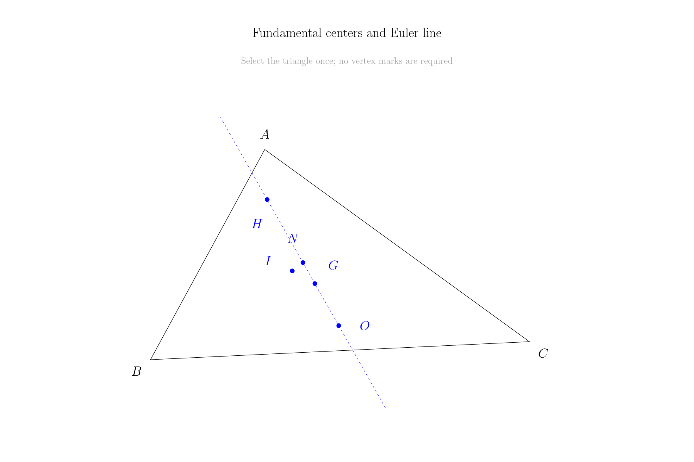
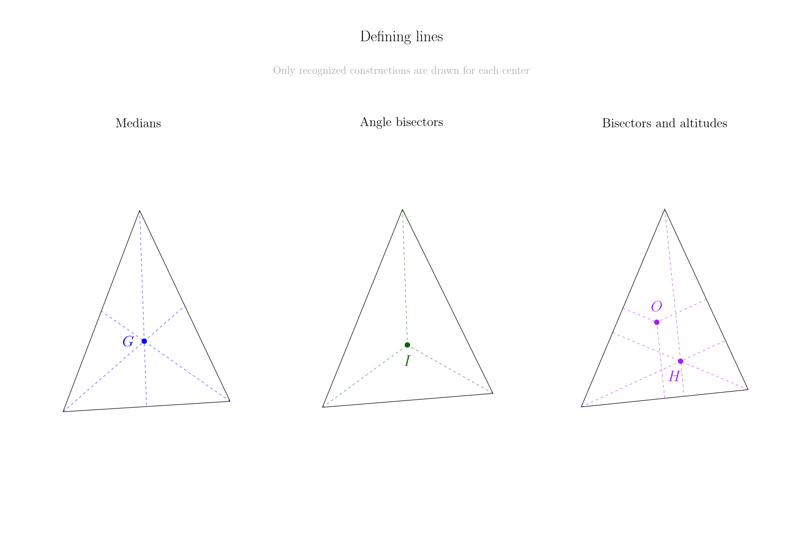
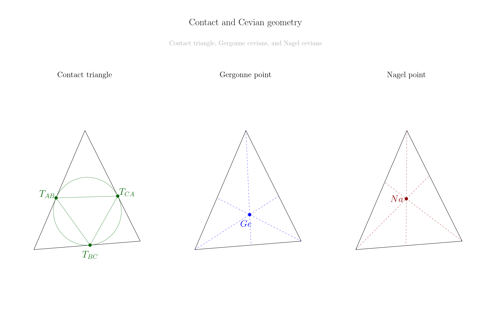
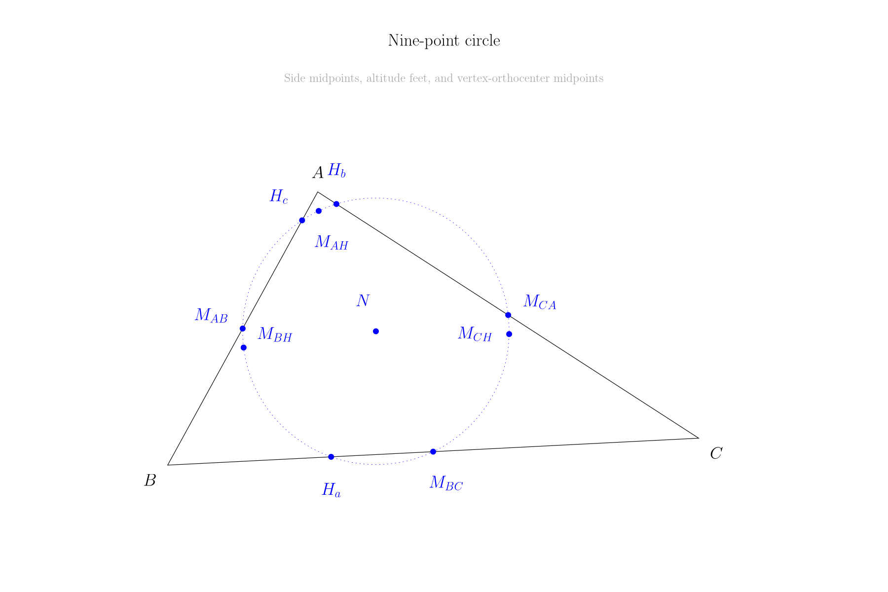
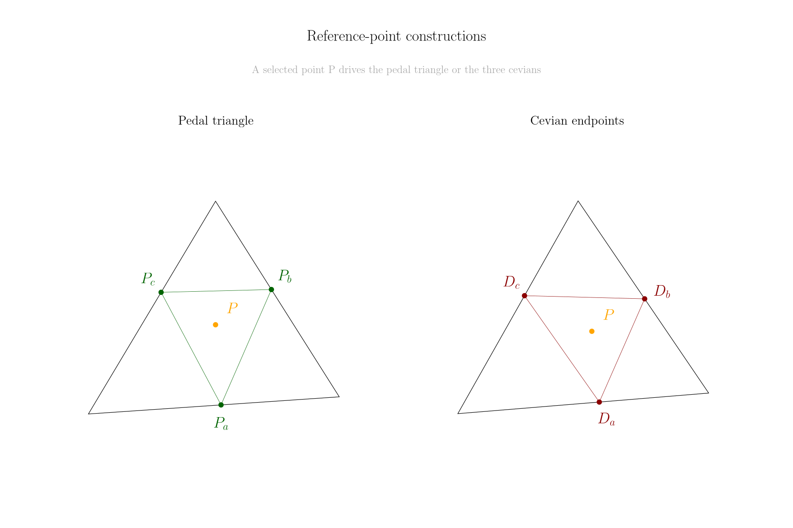
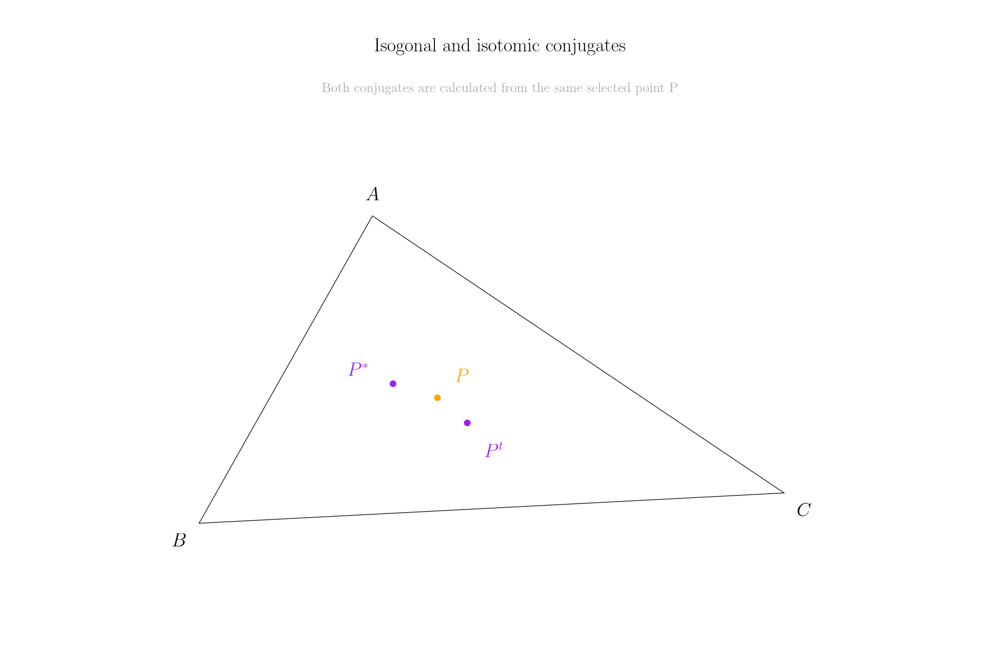
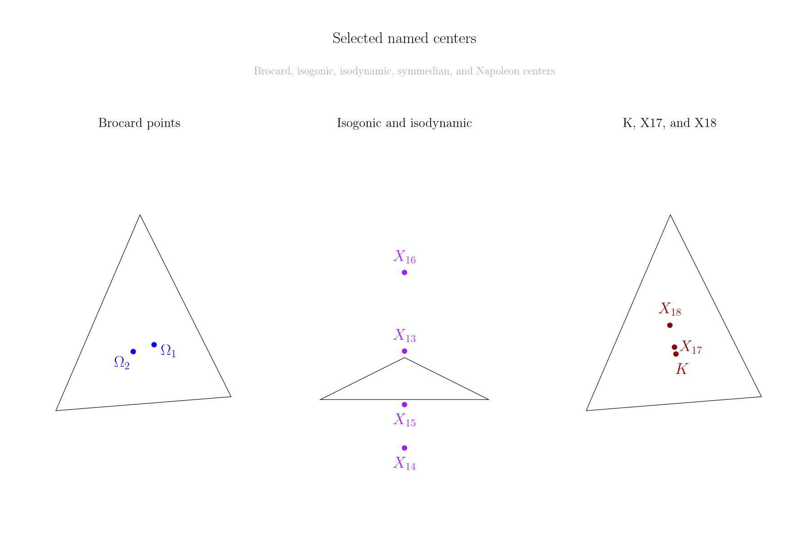

# Triangles

[Leia em português](README.pt-BR.md)

Triangles is a standalone [Ipe](https://ipe.otfried.org/) extension for triangle centers and derived Euclidean constructions. The installed runtime is one Lua file and does not require Geometry, an MCP bridge, or another user ipelet.



## Tools

The ipelet adds two menu entries:

- **Construct: triangle centers** selects any combination of 24 centers or one of four mathematical sets: fundamental, contact/Cevian, Euler-line, and isogonal/Napoleon centers.
- **Construct: derived triangle geometry** creates one of nine derived constructions and exposes an explicit reference-point source when the construction needs one.

## Centers

The available centers are the centroid, incenter, circumcenter, orthocenter, nine-point center, three excenters, Spieker center, Mittenpunkt, Feuerbach point, symmedian point, Gergonne point, Nagel point, de Longchamps point, two Brocard points, the first and second isogonic centers (X13 and X14), two isodynamic points, two Napoleon points, and the Exeter point.

Each center can create a mark and label. The **Defining lines** option draws only a construction that mathematically defines the selected center: medians, angle bisectors, perpendicular bisectors, altitudes, symmedians, or the Gergonne and Nagel cevians. The center dialog creates only the nine-point circle; incircles and excircles remain with the contact-triangle construction, where they are relevant. The Euler line is available independently.

Coincident centers share one mark instead of producing an unreadable stack. Labels are placed around existing points and geometry to keep their association legible. Centers that are ideal, undefined, or numerically unavailable are reported without inserting non-finite geometry.

## Derived constructions

The derived-construction dialog provides:

- medial, orthic, contact, excentral, and pedal triangles;
- all nine points of the nine-point circle;
- cevian endpoints;
- isogonal and isotomic conjugates.

Pedal, cevian, isogonal, and isotomic constructions require a real reference point. Choose an extra selected mark, the centroid, incenter, circumcenter, orthocenter, symmedian point, or explicit coordinates. The reference is never silently replaced by the centroid.

Labels are independent of marks and use semantic names such as `H_a`, `M_{AB}`, and `D_a`. Associated-circle controls are enabled only for contact and nine-point constructions.

## Gallery

Every preview below was rendered by Ipe from the editable [`triangles-feature-gallery.ipe`](examples/triangles-feature-gallery.ipe) document. The document invokes the same public creators used by the menu tools.

For a clear visual hierarchy, each source triangle uses Ipe's `semithick` pen while construction segments retain the `normal` pen.

### Defining lines



### Contact and Cevian geometry



### Nine-point circle



### Reference-point constructions



### Conjugates



### Named centers



## Accepted selection

Before opening a construction dialog, select one of these exact inputs:

1. One closed triangular path made of straight segments.
2. Three Ipe marks at the vertices.
3. Three straight segments that form one closed triangle.

For a point-dependent construction, add one mark to a selected path or three sides. With four selected marks, make the reference point the primary selection; the other three marks define the triangle.

No helper marks are required or inserted. For a path or three sides, the uppermost vertex is `A` (the leftmost one breaks a horizontal tie), and `B` and `C` follow counterclockwise. With three vertex marks, the primary mark is `A`; the remaining vertices follow counterclockwise. This ordering matters only for vertex-specific results such as excenters and labeled Cevian endpoints.

Explicit API coordinates take precedence over the current selection. Output is created on the active layer by default; the dialog can instead use the source triangle's layer. Invisible or locked output layers are reported.

## Numerical behavior

All calculations are performed in a normalized local coordinate system. Side lengths use a scaled `hypot`, barycentric weights are normalized before summation, collinearity checks are relative to the triangle scale, and every point and radius is checked before an Ipe object is created.

This makes one triangle shape behave consistently across very small and very large finite coordinate scales. A genuinely collinear or too ill-conditioned triangle is rejected instead of producing `NaN` or infinite coordinates. Some centers are mathematically non-unique or ideal in symmetric cases; the result reports this state explicitly.

## Installation

From the repository root on Linux:

```bash
./scripts/install.sh triangles
```

The helper detects the Ipe Flatpak directory. For a manual installation, copy `triangles.lua` into your user ipelets directory and restart Ipe.

## Public API

The runtime exports `_G.TRIANGLES` with API version 1. Pure geometry functions can be used without a model:

```lua
local result = TRIANGLES.triangle_center(
  { x = 0, y = 0 },
  { x = 4, y = 0 },
  { x = 1, y = 3 },
  "symmedian_point"
)
assert(result.status == "finite")
```

The public creators are `create_triangle_centers`, `create_triangle_derived`, and `create_triangle_constructions`. They contain input and runtime errors and return a stable result with `created`, `status`, counts, per-construction states, output roles, vertex ordering, and notices. Metadata inspection remains available through the Lua API without occupying another Ipe menu entry.

## Validation

Run the focused suite with:

```bash
./scripts/validate.sh triangles
```

The suite checks syntax, formulas, extreme scales, special triangles, all derived constructions, selection contracts, label clearance, previews, styles, layers, transactions, metadata, packaging, and the standalone runtime surface. When the Ipe Flatpak is available, it also creates, saves, and reopens a disposable document through the real Ipelib runtime.

Editable examples are in [`examples/`](examples/README.md). Release history is in [`CHANGELOG.md`](CHANGELOG.md).

## License

Triangles is licensed under the GNU General Public License, version 3 or any later version. See the repository [LICENSE](../LICENSE) and [NOTICE](../NOTICE.md).
