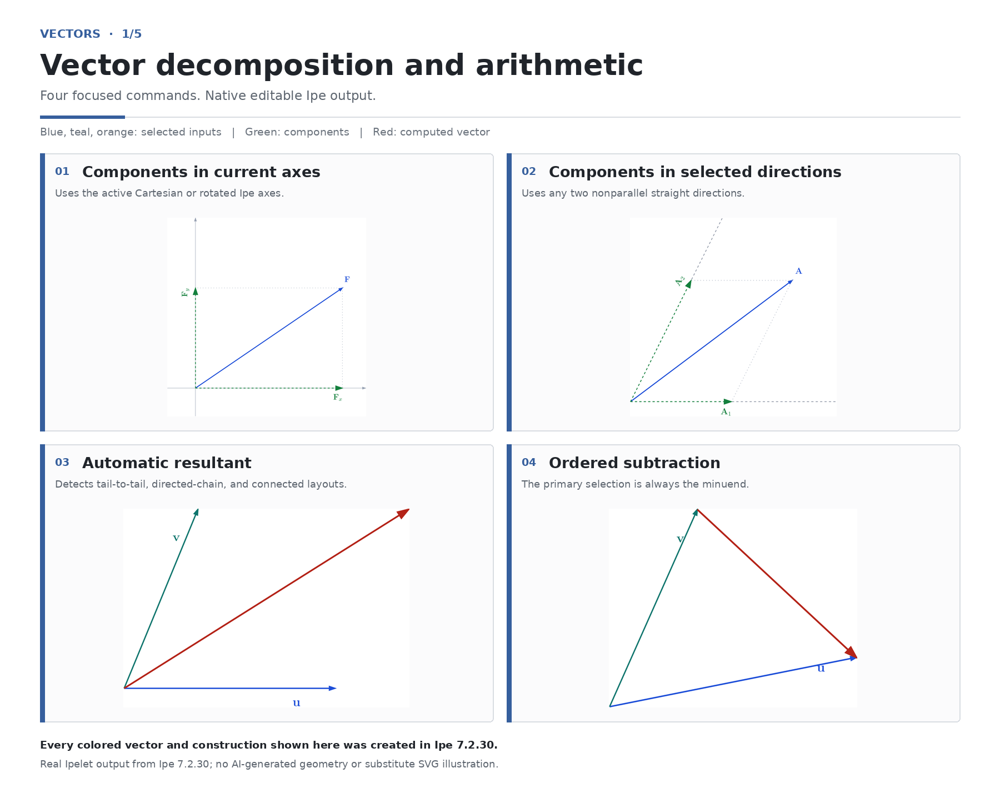
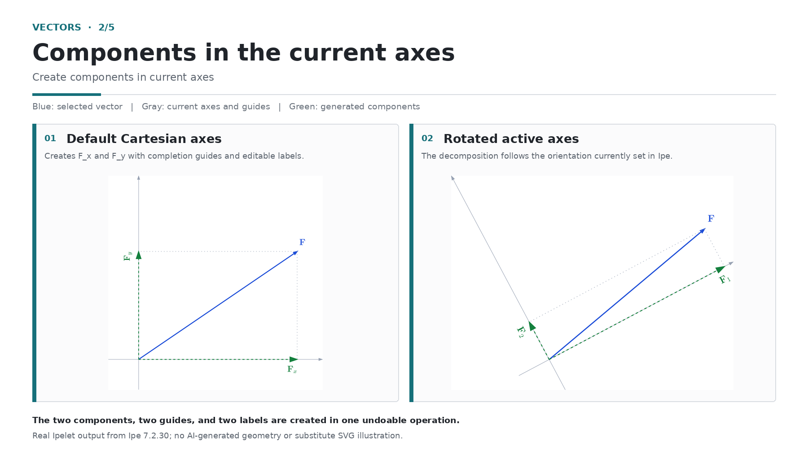
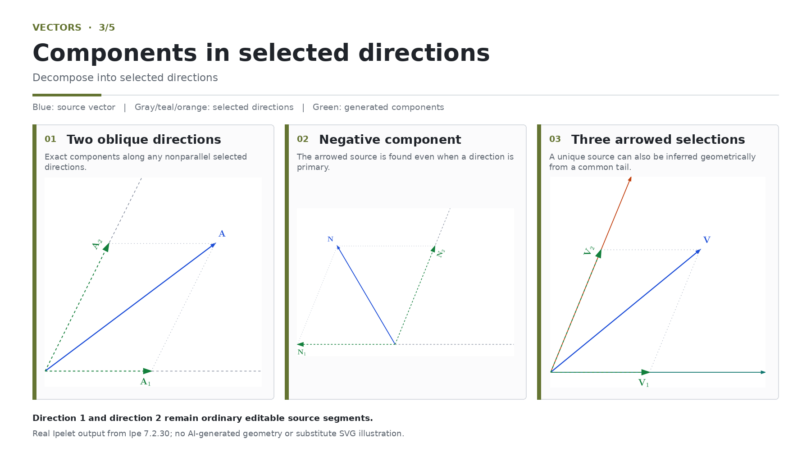
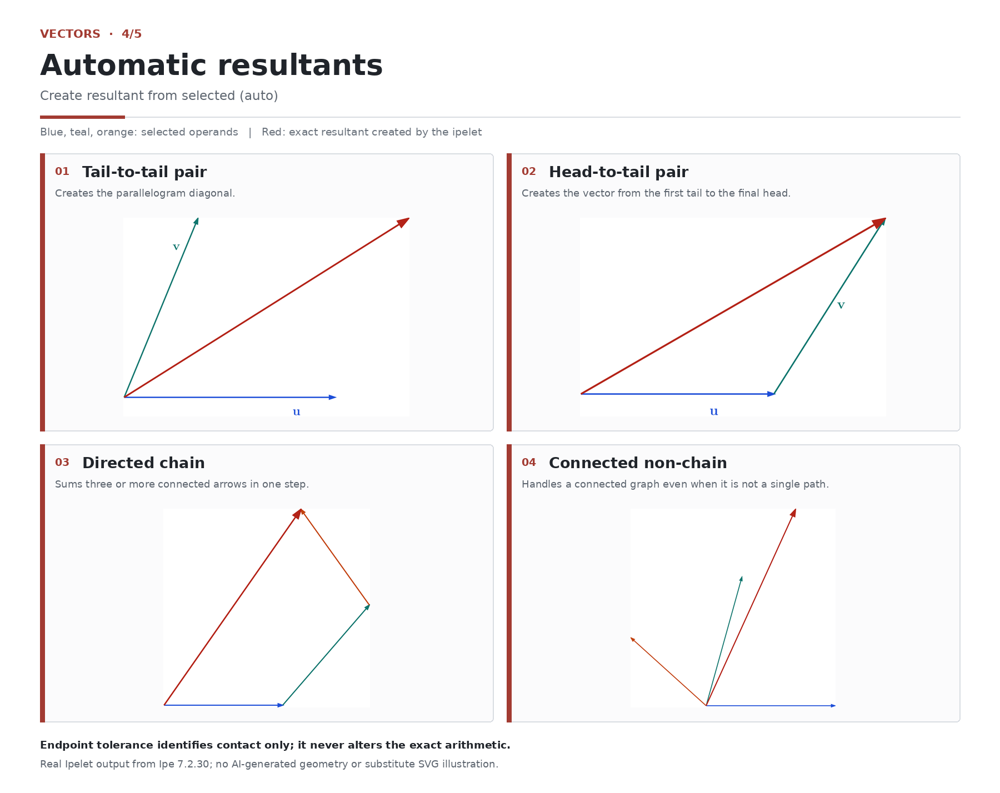
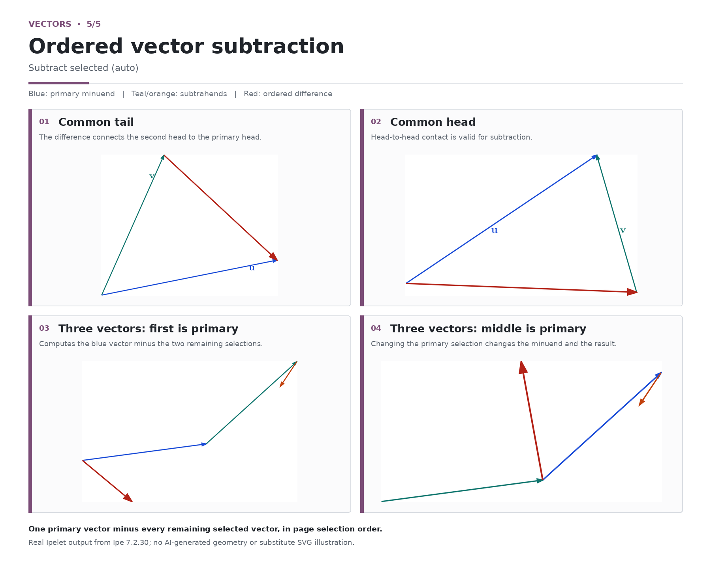
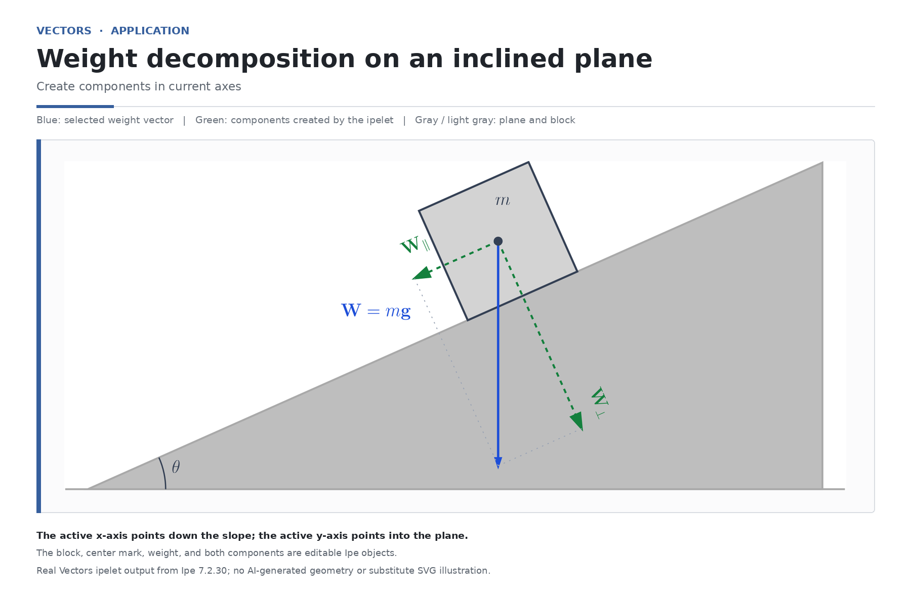

# Vectors

[Read in English](README.md)

Vectors é uma extensão autônoma do [editor de desenhos Ipe](https://ipe.otfried.org/) que decompõe vetores e constrói resultantes exatas e diferenças ordenadas. A instalação utiliza um único arquivo Lua e não depende de outro Ipelet do usuário nem da ponte MCP local.



## Ferramentas

O Ipelet adiciona quatro entradas ao menu:

- **Create components in current axes** decompõe um segmento com seta selecionado nos eixos coordenados ativos do Ipe. Se não houver eixos personalizados ativos, utiliza os eixos cartesianos padrão.
- **Decompose into selected directions** decompõe um vetor com seta em duas direções retas selecionadas e não paralelas.
- **Create resultant from selected (auto)** soma dois ou mais vetores selecionados e conectados e escolhe automaticamente a disposição cauda com cauda, polilinha dirigida ou soma conectada.
- **Subtract selected (auto)** calcula o vetor primário menos todos os demais vetores selecionados, na ordem da seleção.

O diálogo de componentes oferece pré-visualização geométrica ao vivo, ação manual **Preview**, base editável para os rótulos e rótulos `_1 / _2` ou `_x / _y`. Os rótulos finais continuam sendo objetos de texto comuns e editáveis do Ipe.

## Guia visual

### Componentes nos eixos atuais

O primeiro comando acompanha o sistema de coordenadas ativo no Ipe. Sem eixos personalizados, produz componentes cartesianas comuns; com eixos rotacionados, acompanha essa orientação. As duas componentes, as duas guias de fechamento e os dois rótulos são criados em uma única operação que pode ser desfeita.



### Componentes em direções selecionadas

As direções selecionadas podem ser oblíquas e uma componente pode apontar no sentido oposto ao de sua direção definidora. Um vetor de origem com seta única é reconhecido mesmo quando uma direção é a seleção primária. Quando os três segmentos selecionados têm seta e partem de uma extremidade comum, o Vectors também consegue identificar o único vetor de origem situado no cone positivo dos outros dois.



### Resultantes automáticas

Para dois vetores, o comando reconhece disposições cauda com cauda e cabeça com cauda. Com três ou mais vetores, processa uma cadeia dirigida ou qualquer outro grafo conectado pelas extremidades. Os vetores vermelhos do guia são resultados exatos criados pelo Ipelet.



### Subtração ordenada

A seleção primária é o minuendo. Todos os outros vetores selecionados são subtraídos na ordem de seleção da página; portanto, trocar a seleção primária muda o resultado sem alterar os objetos de origem.



### Aplicação física: peso em um plano inclinado

Defina o eixo x ativo no sentido de descida do plano e o eixo y ativo perpendicularmente para dentro do plano; depois, selecione o vetor peso vertical. O mesmo comando de componentes nos eixos atuais cria as componentes exatas no sentido de descida e na direção normal para dentro do plano. O exemplo mantém o plano inclinado cinza, o bloco cinza-claro, a marca central, o peso, as componentes, as guias e os rótulos como objetos editáveis do Ipe.



## Seleções aceitas

Um vetor precisa ser exatamente um caminho aberto com um único segmento reto e uma única direção de seta. Caminhos fechados, curvas, caminhos mistos, vários subcaminhos, segmentos de comprimento zero, caminhos sem ponta de seta e caminhos com duas pontas são recusados com uma mensagem clara.

Para decompor em direções selecionadas, selecione exatamente três objetos. Se apenas um tiver ponta de seta, ele será o vetor de origem mesmo que outro objeto seja a seleção primária. Se os três tiverem seta e partirem de uma extremidade comum, o Vectors usará o único segmento que possua duas componentes positivas nas outras direções, quando ele existir. Caso contrário, torne o vetor de origem a seleção primária. Os outros dois objetos definem as direções 1 e 2 na ordem de seleção da página e podem ser segmentos retos sem seta.

Para resultantes e subtrações, selecione pelo menos dois vetores com seta cujas extremidades formem um único grafo conectado. A resultante de dois vetores exige contato cauda com cauda ou cabeça com cauda; um par cabeça com cabeça é deliberadamente recusado porque não determina nenhuma das duas disposições de resultante aceitas. A subtração aceita todas as orientações com uma extremidade compartilhada. A seleção primária é processada primeiro: ela ancora uma resultante conectada que não forme cadeia e é sempre o minuendo da subtração. Os demais operandos seguem a ordem de seleção da página. `touch_tolerance` serve somente para reconhecer o contato entre extremidades; ela nunca altera um vetor de origem nem a soma ou diferença resultante.

Grupos de seta corrigida criados pelo ArrowFix são aceitos. Espessuras e tamanhos de seta numéricos continuam numéricos, e traços RGB explícitos continuam sendo cores, em vez de nomes simbólicos não resolvidos.

## Saída e estilos

Componentes, guias, rótulos, resultantes e diferenças são criados como objetos soltos e editáveis. Uma construção de componentes é registrada como uma única transação atômica do Ipe; uma única ação Desfazer remove o resultado completo. Os componentes são tracejados, os guias são pontilhados e os vetores gerados permanecem sempre somente com traço e uma ponta de seta à frente.

O estilo do vetor de origem é herdado quando faz sentido. Sobrescritas públicas de atributos usam uma lista permitida e são validadas na folha de estilos ativa antes da criação. Cores inválidas, atributos desconhecidos, modos de caminho incompatíveis, booleanos malformados, estilos simbólicos ausentes e entradas numéricas não finitas são recusados, em vez de serem repassados ao Ipe.

Cada objeto gerado recebe metadados personalizados escapados com seu papel e os índices das seleções de origem. Esses índices descrevem o documento no momento da criação; mover ou excluir objetos anteriores depois disso não reescreve os metadados históricos.

## Instalação

Baixe o pacote autocontido na [versão 1.0.0 de Vectors](https://github.com/japbcoelho/ipelets/releases/tag/vectors-v1.0.0) ou instale-o diretamente pelo repositório.

Na raiz do repositório, no Linux:

```bash
./scripts/install.sh vectors
```

O utilitário detecta a pasta do Ipe instalado por Flatpak. Para uma instalação manual, coloque `vectors.lua` na pasta de Ipelets do usuário e reinicie o Ipe ou recarregue os Ipelets.

## API pública

O arquivo exporta `_G.VECTORS` com versão de API 1. Funções de geometria pura podem ser utilizadas sem criar objetos no Ipe:

```lua
local components = VECTORS.components_in_directions(
  { x = 30, y = 40 },
  { x = 1, y = 0 },
  { x = 1, y = 1 }
)
assert(math.abs(components.first_scalar + 10) < 1e-9)
```

Os criadores públicos são `create_selected_vector_components`, `create_selected_vector_components_in_directions`, `create_selected_vector_resultant_auto` e `create_selected_vector_subtraction_auto`. Eles validam toda a entrada antes do registro e retornam tabelas estáveis com contagens, índices das origens, modos, contatos, escalares e vetores resultantes exatos.

## Validação

Execute a suíte específica com:

```bash
./scripts/validate.sh vectors
```

A suíte confere sintaxe, geometria, topologia, escalas extremas, compatibilidade com ArrowFix, caminhos e opções estritos, desfazer atômico, metadados, pré-visualizações, desempenho, empacotamento e isolamento do arquivo autônomo.

A fonte editável de 13 páginas com os fluxos, a aplicação separada no plano inclinado e os detalhes sobre as seis pranchas de apresentação estão em [`examples/`](examples/README.md). O histórico está em [`CHANGELOG.md`](CHANGELOG.md).

## Licença

Vectors é licenciado sob a GNU General Public License, versão 3 ou qualquer versão posterior. Consulte [LICENSE](../LICENSE) e [NOTICE](../NOTICE.md).
